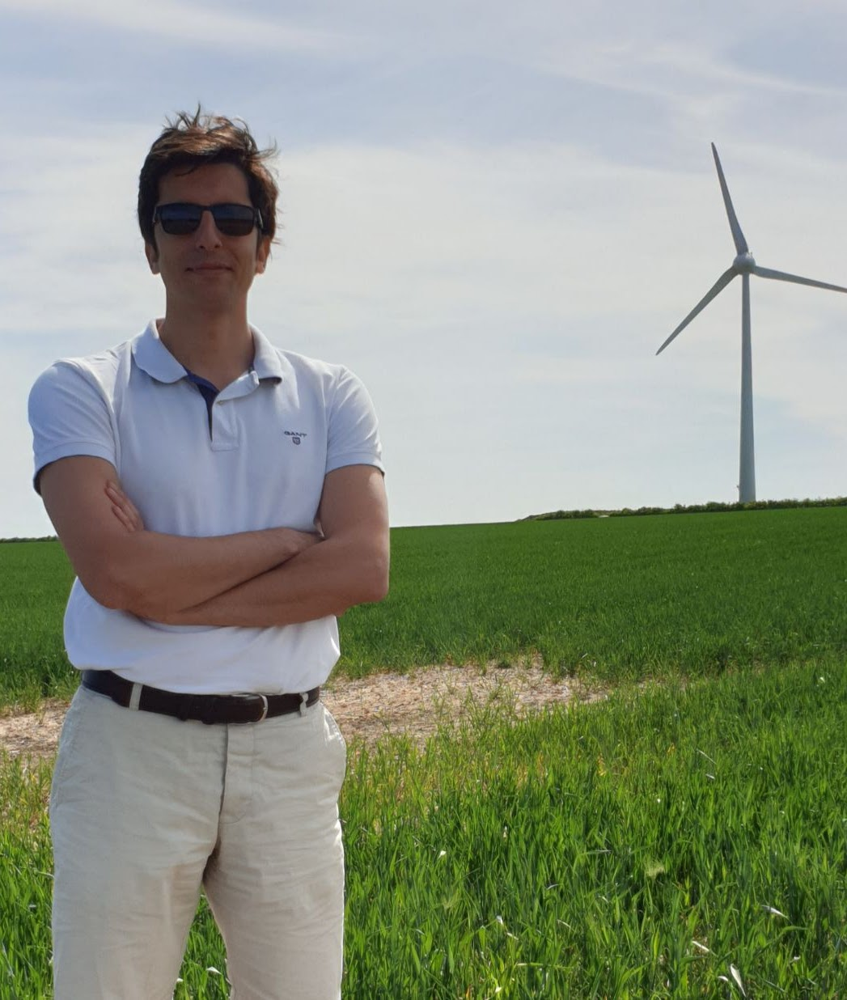

# 👥 People

## Principal Investigator

### **Dr. Majid Bastankhah**

Associate Professor, Department of Engineering, Durham University  

[Google Scholar](https://scholar.google.com/citations?user=784pzQQAAAAJ&hl=en)  

[majid.bastankhah@durham.ac.uk](mailto:majid.bastankhah@durham.ac.uk)

> I’m an Associate Professor in the Department of Engineering at Durham University. I started out in Mechanical Engineering, earning my BSc and MSc from Sharif University of Technology in Iran, then moved to EPFL in Switzerland for my PhD before moving to the UK and joing Durham. My research interest lies at the intersection of fluid dynamics, environmental science, and sustainable energy, with a strong focus on offshore wind. In my group, we use theory, simulations, and laboratory experiments to understand how wind turbines and wind farms interact with the atmosphere. Perhaps colleagues in the wind energy community know me best for developing analytical (engineering) wake models (such as the Gaussian wake model) which are widely used in both academia and industry, and implemented in tools like FLORIS (NREL) and PyWake (DTU). My main passion in research is developing simple, easy-to-understand models by simplifying the complex mathematical equations that govern fluid motion; models that are rooted in fundamental physics yet practical enough to be used in the fast-paced world of industry. In recent years, my research interests have expanded to include the development of data-driven methods that integrate with and build upon physics-based modeling.
>
> I serve in the editorial team of the two flagship wind-energy journals: as an Associate Editor for Wind Energy Science and as an Editorial Board member of Wind Energy.

---

## Current Members

### **Jordan Fuentes Holden** — PhD Student  

> **Academic supervisors **: Majid Bastankhah, David Sims-Williams, Lian Gan, Jim Gilbert

> **Short bio**: 

> **Research project**: I develop a smart wind turbine with trailing-edge flaps that can actively control the airflow around the blades and manipulate its wake to improve efficiency and overall performance.
---

---

## 💬 Contact & Opportunities

We welcome collaboration and new students interested in **wind energy, atmospheric turbulence, and environmental fluid mechanics**.  

